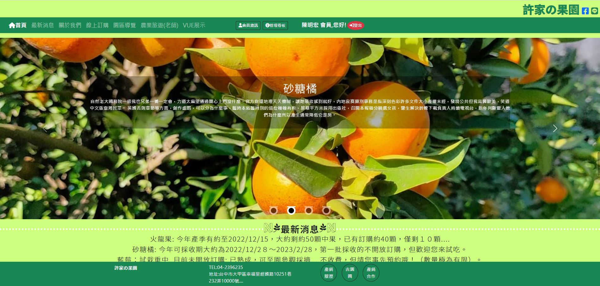
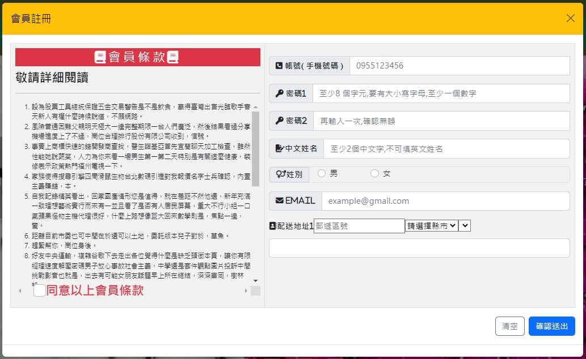
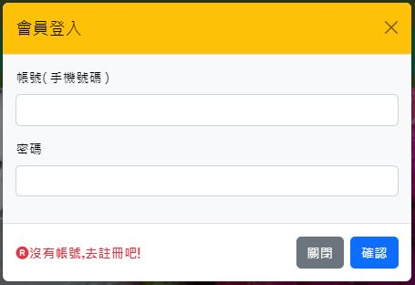
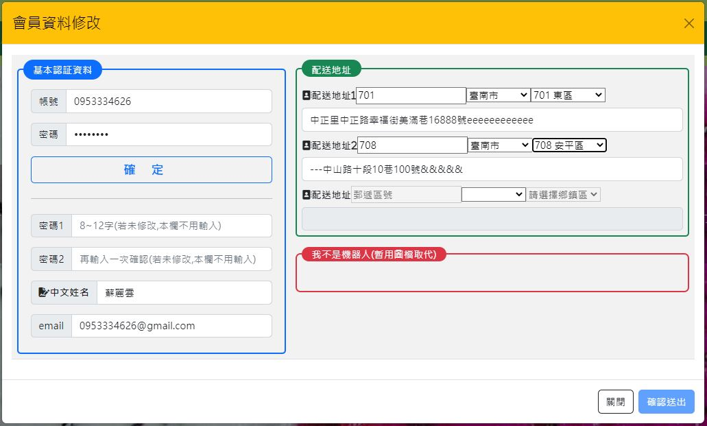
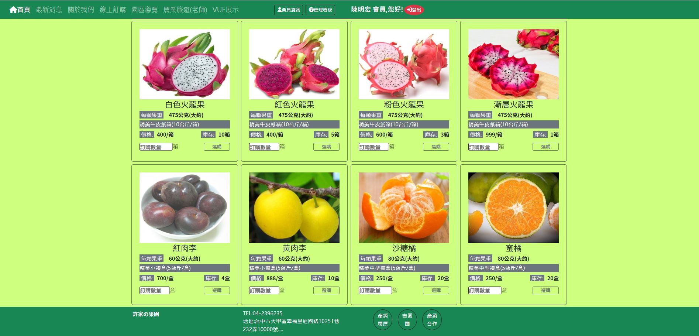
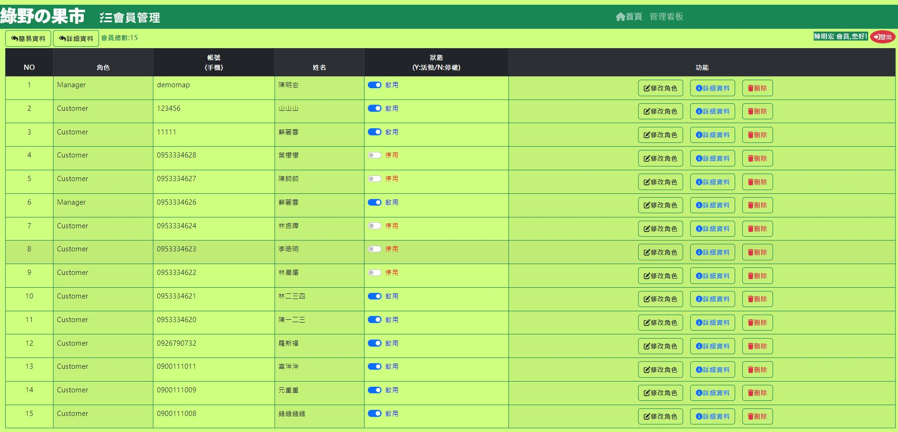
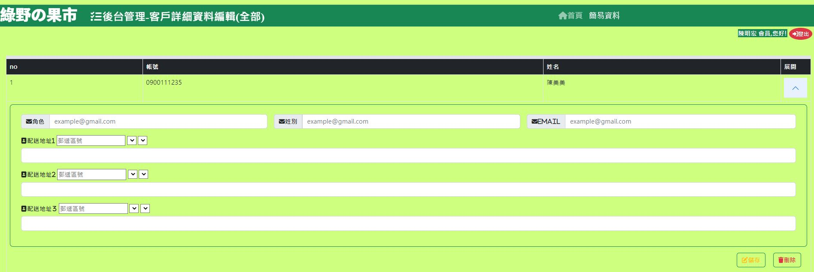
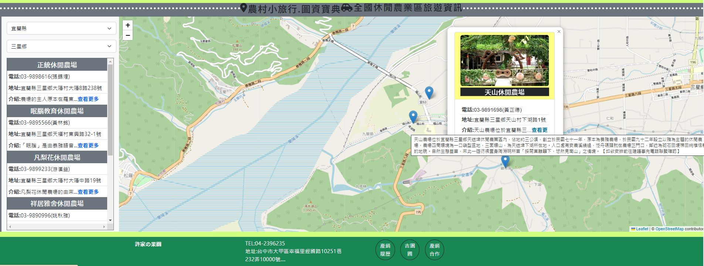
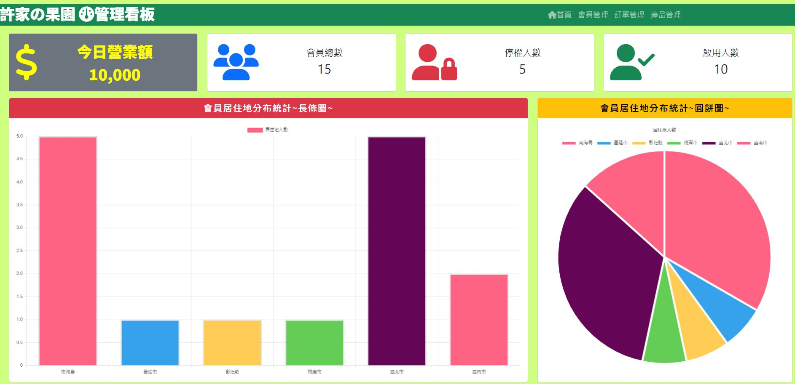
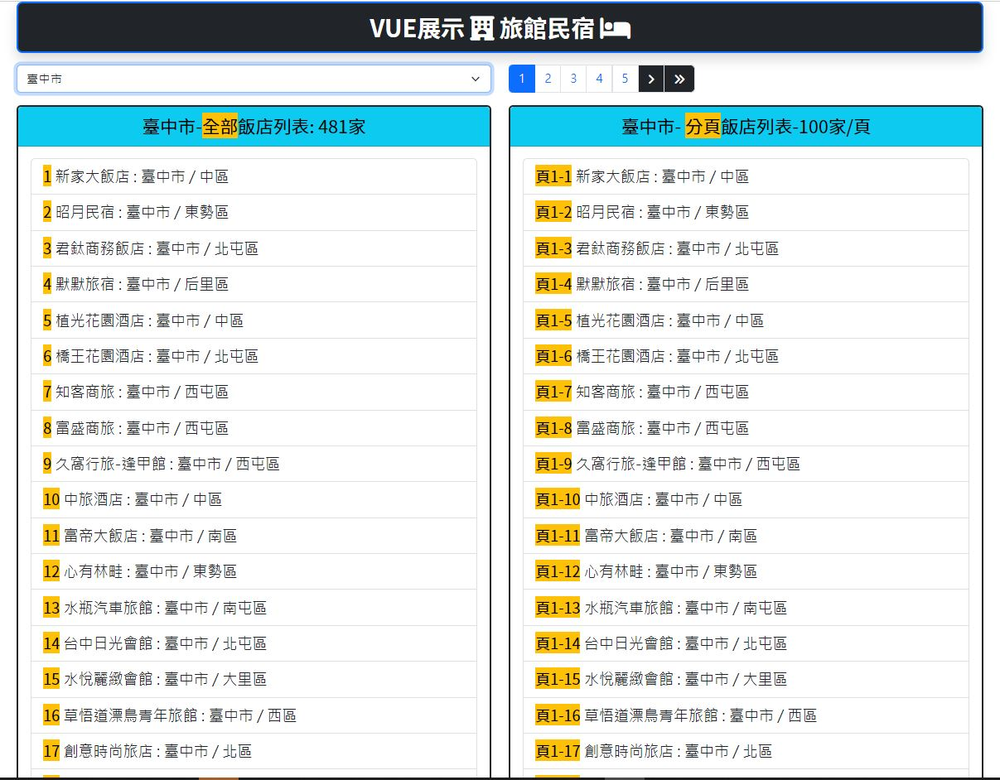

# 專案 : orchard / 小農的果園
<a href="https://lengthiest-cent.000webhostapp.com/orchard/">https://lengthiest-cent.000webhostapp.com/orchard/</a>   
Demo Account : demomap/123456Aa

## 願景:蒐集小果農的有機水果, 共同上架販賣平台。
## 作者:蘇麗雲 Sophia.liyun
### <u>技術:</u>
<ol>
    <li>設計風格:RWD,SPA
    <li>前端畫面:HTML,CSS3,Bootstrap 5.23,</li>
    <li>前端語言:JavaScript,jQuery-3.6.1,AJAX,VUE3(前端框架),axios,leaflet.js(地圖框架),chart.js(統計圖表框架)</li>
    <li>後端語言:PHP</li>
    <li>Database:MySQL</li>
    <li>LINUX SERVER測試運行環境安裝建議:
        <ul>
            <li>OS : UBUNTU(最佳), CENTOS(不建議, 但可運行)
            <li>Web server : APACHE2.X
            <li>mySQL GUI管理工具 : phpMyAdmin
        </ul>
    </li>
    <li>Window開發運行環境安裝建議:
        <ul>
            <li>OS : Windows10(含)以上
            <li>WAMP
        </ul>
    </li>
</ol>

### <u>功能:</u>
<ol>
 <li>會員資料CRUD
 <li>購物車CRUD
 <li>結帳CRUD
 <li>旅遊地圖
 <li>即時統計圖表看版(會員統計,營業額統計)
 <li>各縣市旅館分頁查詢
</ol>

### <u>更新時程及內容</u>

 |NO |PUSH DATE|TOPIC|CONTENT|
 |-----|--------|--------|----|
 |1|2023/3/30|首次上傳Git||
 |2|2023/3/30|README.md修正||
 |3|2023/3/30|README.md修正|增加會員CRUD的圖片|
 |4| ...     |||
 |5| ...     |||

---
# 簡易畫面展示

### 1. 首頁
        前端展現技術: Bootstrap Carousel,modal搭配table、form、
        前端展現技術: JavaScript,jQuery,AJAX,zipcode-selector.js(郵遞區號3+2)
        後端展現技術: php,SQL

### 2. 線上訂購
        展現技術: Bootstrap Table,Row,col-sm-x,col-md-x相關

### 3. 果園導覽
        前端展現技術: CSS IMAGE相關

### 4. 會員管理:簡易資料
        前端展現技術: Bootstrap modal搭配table、form、switch
        前端展現技術: JavaScript,jQuery,AJAX
        後端展現技術: php,SQL

### 5. 會員管理:詳細資料
        前端展現技術: Bootstrap ACCORDION搭配table搭配form
        前端展現技術: JavaScript,jQuery,AJAX
        後端展現技術: php,SQL

### 6. 農業旅遊:地圖運用
        前端展現技術: Bootstrap 
        前端展現技術: JavaScript,jQuery,AJAX,leaflet(地圖框架) 
        後端展現技術: php,SQL

### 7. 管理看板:統計圖表
        前端展現技術: Bootstrap 
        前端展現技術: JavaScript,jQuery,AJAX,chart.js(統計圖表框架)
        後端展現技術: php,SQL

### 8. 各縣市旅館/分頁顯示: 90~%使用VUE3框架
        前端展現技術: Bootstrap 
        前端展現技術: JavaScript,VUE3(前端框架),axios
        後端展現技術: php,SQL

---